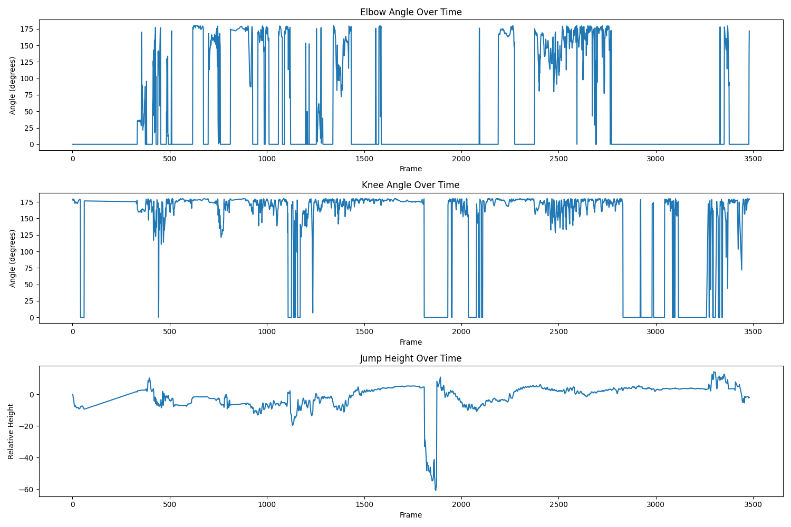

# Basketball Pose Analysis

This project analyzes basketball player poses from video footage using computer vision and pose estimation techniques.

## Project Structure
- `src/`: Source code directory
- `data/`: Directory for storing video data
- `models/`: Directory for storing trained models or weights
- `utils/`: Utility functions
- `requirements.txt`: Project dependencies

## Setup
1. Create a virtual environment:
```bash
python -m venv venv
source venv/bin/activate  # On Windows: venv\Scripts\activate
```

2. Install dependencies:
```bash
pip install -r requirements.txt
```

## Usage
[Usage instructions will be added as the project develops]

## Analysis Results

The latest analysis was performed on January 16, 2025, focusing on player movement and form. Here are the key findings:

### Player Movement Statistics
- **Elbow Angle**: Average of 50.67 degrees
  - This indicates a good shooting form with the elbow well-positioned for shot accuracy
- **Jump Height**: Maximum height of 14.42 units
  - Shows significant vertical leap capability during shooting or defensive movements
- **Knee Angle**: Average of 139.46 degrees
  - Demonstrates proper knee bend for explosive movements and stable landing

### Visual Analysis
Below is the visualization of the player's movement analysis:



*Figure 1: Analysis of player's movement patterns showing joint angles and trajectories during gameplay.*

### Recommendations
Based on these measurements:
1. The elbow angle (50.67°) is slightly lower than the optimal range (65-70°) for shooting form
2. Knee angle shows good flexion, supporting proper jumping mechanics
3. Jump height indicates strong lower body power generation

### Next Steps
- Continue monitoring elbow angle during shooting drills
- Maintain current lower body mechanics as they show good form
- Consider analyzing release point height in future assessments
